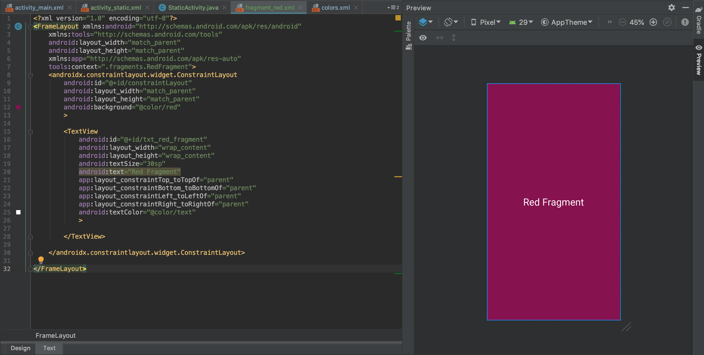

# Embedded Fragment

Embedded fragment adalah fragment yang dipasang ke sebuah activity dengan cara meng-embed (memasukkannya) melalui xml activity android, dengan cara ini sebuah fragment dapat dengan cepat di integrasikan kepada sebuah xml dari activity dengan memanggil nya menggunakan tag `<fragment>`

## Langkah Percobaan

- Bukalah project "Praktikum Fragment" menggunakan Android Studio anda.
- Buatlah sebuah package baru pada project anda dengan nama `activities`. Pada package ini nanti akan di isi activity baru yang menjadi wadah bagi fragment yang akan dibuat. Langkah pembuatannya terlihat pada gambar dibawah ini :

  1.  Buka file tree project (Alt + 1)
  2.  Arahkan Kursor ke package utama
  3.  Alt + insert untuk menampilkan floating menu
      
  4.  Ketikkan "package" kemudian enter dan berikan nama package yang sesuai.
      
      

- Buatlah sebuah package baru dengan nama `fragments` pada package utama project. Pada package ini nanti akan berisi seluruh fragment yang digunakan pada aplikasi, cara pembuatannya sama dengan proses pada langkah ke dua.
- Berikut ini tampilan struktur project jika anda melakukan proses ini dengan benar.
  
- Selanjutnya bukalah file xml `activity_main.xml` dengan menambahkan 4 buah tombol berilah attribut berikut ini :

| No  | id                     | text                     | onClick                       |
| --- | ---------------------- | ------------------------ | ----------------------------- |
| 1   | btn_static_fragment    | Contoh Static Fragment   | handlerClickStaticFragment    |
| 2   | btn_dynamic_fragment   | Contoh Dynamic Fragment  | handlerClickDynamicFragment   |
| 3   | btn_praktikum_fragment | Tugas Praktikum Fragment | handlerClickPraktikumFragment |

- _Lengkapi dengan mengenerate fungsi handler untuk masing masing tombol_ dan aturlah layout nya agar menjadi seperti pada gambar dibawah ini.
  
  
  

- Pada package activity buatlah sebuah empty activity baru untuk menjadi wadah bagi fragment static, berilah nama activity tersebut dengan nama `StaticActivity`
  

  

- Pada package `fragments` buatlah sebuah `blank fragment` dan berilah nama `red fragment`, perhatikan proses pembuatan fragment ini dimana dua opsi `include fragment factory` dan `include iterface callback` **tidak** dipilih

  
  

- Ubah lah tampilan dari fragment yang baru saja dibuat menjadi seperti berikut ini.

  
