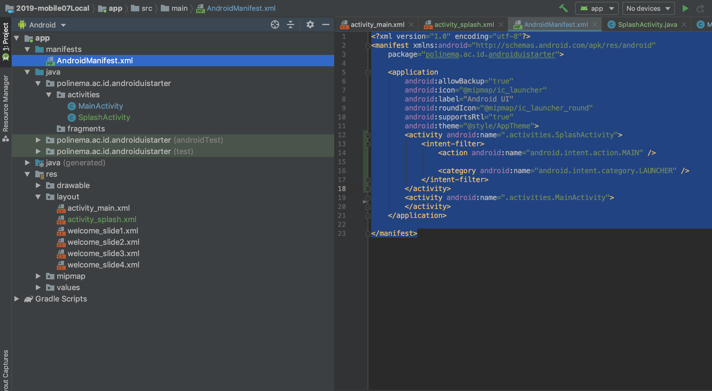
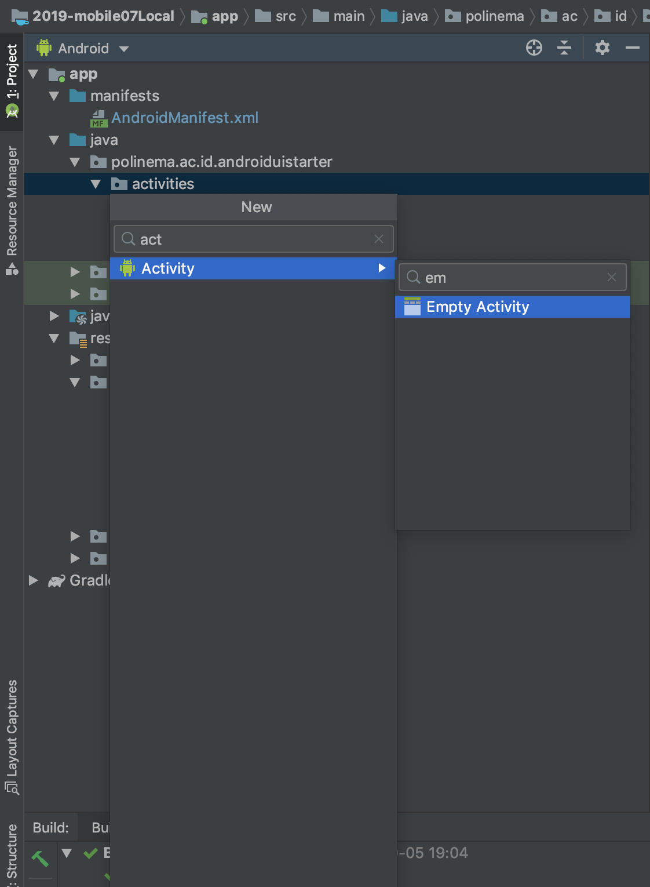

# View Pager

View Pager merupakan fitur untuk membagi konten yang panjang pada android menjadi konten yang ter bagi menjadi beberapa halaman. View pager dapat diimplementasikan menggunakan fragment atau layout xml. Pada praktikum ini akan dijelaskan bagaimana cara membuat viewpager dengan menggunakan data dari file layout xml. Berikut ini referensi bahan belajar dan tutorial :

1. https://www.androidhive.info/2016/05/android-build-intro-slider-app/

## Langkah Percobaan

- Untuk membuat viewpager dibutuhkan beberapa layout xml.
- Pada starter code anda sudah diberikan beberapa layout page yang akan di bagi kedalam view pager.
- Buatlah activity baru berilah nama `WelcomeActivity`
  
  
- Ubahlah kode program pada `SplashScreenActivity` agar melakukan intent ke `WelcomeActivity` seperti berikut ini :

```java
    @Override
    protected void onCreate(Bundle savedInstanceState) {
        super.onCreate(savedInstanceState);
        setContentView(R.layout.activity_splash);

        new Handler().postDelayed(new Runnable() {
            @Override
            public void run() {
                startActivity(new Intent(SplashActivity.this,WelcomeActivity.class));
                finish();
            }
        },5000);
    }

```

- Ubah layout `activitiy_welcome.xml` dengan kode program berikut
  ```xml
  <?xml version="1.0" encoding="utf-8"?>
  <RelativeLayout xmlns:android="http://schemas.android.com/apk/res/android"
    xmlns:app="http://schemas.android.com/apk/res-auto"
    xmlns:tools="http://schemas.android.com/tools"
    android:layout_width="match_parent"
    android:layout_height="match_parent"
    tools:showIn="@layout/activity_welcome">
  ```


    <androidx.viewpager.widget.ViewPager
        android:id="@+id/view_pager"
        android:layout_width="match_parent"
        android:layout_height="match_parent" />

    <LinearLayout
        android:id="@+id/layoutDots"
        android:layout_width="match_parent"
        android:layout_height="@dimen/dots_height"
        android:layout_alignParentBottom="true"
        android:layout_marginBottom="@dimen/dots_margin_bottom"
        android:gravity="center"
        android:orientation="horizontal"></LinearLayout>

    <View
        android:layout_width="match_parent"
        android:layout_height="1dp"
        android:alpha=".5"
        android:layout_above="@id/layoutDots"
        android:background="@android:color/white" />

    <Button
        android:id="@+id/btn_next"
        android:layout_width="wrap_content"
        android:layout_height="wrap_content"
        android:layout_alignParentBottom="true"
        android:layout_alignParentRight="true"
        android:background="@null"
        android:text="@string/next"
        android:textColor="@android:color/white" />

    <Button
        android:id="@+id/btn_skip"
        android:layout_width="wrap_content"
        android:layout_height="wrap_content"
        android:layout_alignParentBottom="true"
        android:layout_alignParentLeft="true"
        android:background="@null"
        android:text="@string/skip"
        android:textColor="@android:color/white" />

</RelativeLayout>
  ```

- Edit file `WelcomeActivity.java` tambahkan class variabel sebagai berikut :

  ```java
  public class WelcomeActivity extends AppCompatActivity {
    private ViewPager viewPager;
    private MyViewPagerAdapter myViewPagerAdapter;
    private LinearLayout dotsLayout;
    private TextView[] dots;
    private int[] layouts;
    private Button btnSkip, btnNext;
    //lanjutan kode program

  ```

- Edit file `WelcomeActivity.java` tambahkan referensi dari variabel ke layout pada method onCreate

```java
    protected void onCreate(Bundle savedInstanceState) {
        super.onCreate(savedInstanceState);
        setContentView(R.layout.activity_welcome);

        viewPager = findViewById(R.id.view_pager);
        dotsLayout = findViewById(R.id.layoutDots);
        btnSkip = findViewById(R.id.btn_skip);
        btnNext = findViewById(R.id.btn_next);
        //variabel untuk menampung layout yang akan di viewpager kan
        layouts = new int[]{
                R.layout.welcome_slide1,
                R.layout.welcome_slide2,
                R.layout.welcome_slide3,
                R.layout.welcome_slide4};

    }
```

- Edit file `WelcomeActivity.java` tambahkan fungsi helper berikut ini

```java
    private void addBottomDots(int currentPage) {
        dots = new TextView[layouts.length];

        int[] colorsActive = getResources().getIntArray(R.array.array_dot_active);
        int[] colorsInactive = getResources().getIntArray(R.array.array_dot_inactive);

        dotsLayout.removeAllViews();
        for (int i = 0; i < dots.length; i++) {
            dots[i] = new TextView(this);
            dots[i].setText(Html.fromHtml("&#8226;"));
            dots[i].setTextSize(35);
            dots[i].setTextColor(colorsInactive[currentPage]);
            dotsLayout.addView(dots[i]);
        }

        if (dots.length > 0)
            dots[currentPage].setTextColor(colorsActive[currentPage]);
    }


    private int getItem(int i) {
        return viewPager.getCurrentItem() + i;
    }

    private void launchHomeScreen() {
        startActivity(new Intent(WelcomeActivity.this, MainActivity.class));
        finish();
    }

```

- Edit file `WelcomeActivity.java` tambahkan class viewpager dan listener viewpager :

```java
    //  viewpager change listener
    ViewPager.OnPageChangeListener viewPagerPageChangeListener = new ViewPager.OnPageChangeListener() {

        @Override
        public void onPageSelected(int position) {
            addBottomDots(position);

            // changing the next button text 'NEXT' / 'GOT IT'
            if (position == layouts.length - 1) {
                // last page. make button text to GOT IT
                btnNext.setText(getString(R.string.start));
                btnSkip.setVisibility(View.GONE);
            } else {
                // still pages are left
                btnNext.setText(getString(R.string.next));
                btnSkip.setVisibility(View.VISIBLE);
            }
        }

        @Override
        public void onPageScrolled(int arg0, float arg1, int arg2) {

        }

        @Override
        public void onPageScrollStateChanged(int arg0) {

        }
    };

    /**
     * View pager adapter
     */
    public class MyViewPagerAdapter extends PagerAdapter {
        private LayoutInflater layoutInflater;

        public MyViewPagerAdapter() {
        }

        @Override
        public Object instantiateItem(ViewGroup container, int position) {
            layoutInflater = (LayoutInflater) getSystemService(Context.LAYOUT_INFLATER_SERVICE);

            View view = layoutInflater.inflate(layouts[position], container, false);
            container.addView(view);

            return view;
        }

        @Override
        public int getCount() {
            return layouts.length;
        }

        @Override
        public boolean isViewFromObject(View view, Object obj) {
            return view == obj;
        }


        @Override
        public void destroyItem(ViewGroup container, int position, Object object) {
            View view = (View) object;
            container.removeView(view);
        }
    }

```

- Edit file `WelcomeActivity.java` tambahkan perintah berikut pada OnCreate :

```java
    @Override
    protected void onCreate(Bundle savedInstanceState) {
        super.onCreate(savedInstanceState);
        setContentView(R.layout.activity_welcome);

        viewPager = findViewById(R.id.view_pager);
        dotsLayout = findViewById(R.id.layoutDots);
        btnSkip = findViewById(R.id.btn_skip);
        btnNext = findViewById(R.id.btn_next);
        layouts = new int[]{
                R.layout.welcome_slide1,
                R.layout.welcome_slide2,
                R.layout.welcome_slide3,
                R.layout.welcome_slide4};

        addBottomDots(0);

        myViewPagerAdapter = new MyViewPagerAdapter();
        viewPager.setAdapter(myViewPagerAdapter);
        viewPager.addOnPageChangeListener(viewPagerPageChangeListener);

        btnSkip.setOnClickListener(new View.OnClickListener() {
            @Override
            public void onClick(View v) {
                launchHomeScreen();
            }
        });

        btnNext.setOnClickListener(new View.OnClickListener() {
            @Override
            public void onClick(View v) {
                // checking for last page
                // if last page home screen will be launched
                int current = getItem(+1);
                if (current < layouts.length) {
                    // move to next screen
                    viewPager.setCurrentItem(current);
                } else {
                    launchHomeScreen();
                }
            }
        });
    }
```

- Berikut ini keseluruhan hasil edit file `WelcomeActivity.java`

```java
public class WelcomeActivity extends AppCompatActivity {
    private ViewPager viewPager;
    private MyViewPagerAdapter myViewPagerAdapter;
    private LinearLayout dotsLayout;
    private TextView[] dots;
    private int[] layouts;
    private Button btnSkip, btnNext;

    @Override
    protected void onCreate(Bundle savedInstanceState) {
        super.onCreate(savedInstanceState);
        setContentView(R.layout.activity_welcome);

        viewPager = findViewById(R.id.view_pager);
        dotsLayout = findViewById(R.id.layoutDots);
        btnSkip = findViewById(R.id.btn_skip);
        btnNext = findViewById(R.id.btn_next);
        layouts = new int[]{
                R.layout.welcome_slide1,
                R.layout.welcome_slide2,
                R.layout.welcome_slide3,
                R.layout.welcome_slide4};

        addBottomDots(0);

        myViewPagerAdapter = new MyViewPagerAdapter();
        viewPager.setAdapter(myViewPagerAdapter);
        viewPager.addOnPageChangeListener(viewPagerPageChangeListener);

        btnSkip.setOnClickListener(new View.OnClickListener() {
            @Override
            public void onClick(View v) {
                launchHomeScreen();
            }
        });

        btnNext.setOnClickListener(new View.OnClickListener() {
            @Override
            public void onClick(View v) {
                // checking for last page
                // if last page home screen will be launched
                int current = getItem(+1);
                if (current < layouts.length) {
                    // move to next screen
                    viewPager.setCurrentItem(current);
                } else {
                    launchHomeScreen();
                }
            }
        });
    }

    private void addBottomDots(int currentPage) {
        dots = new TextView[layouts.length];

        int[] colorsActive = getResources().getIntArray(R.array.array_dot_active);
        int[] colorsInactive = getResources().getIntArray(R.array.array_dot_inactive);

        dotsLayout.removeAllViews();
        for (int i = 0; i < dots.length; i++) {
            dots[i] = new TextView(this);
            dots[i].setText(Html.fromHtml("&#8226;"));
            dots[i].setTextSize(35);
            dots[i].setTextColor(colorsInactive[currentPage]);
            dotsLayout.addView(dots[i]);
        }

        if (dots.length > 0)
            dots[currentPage].setTextColor(colorsActive[currentPage]);
    }


    private int getItem(int i) {
        return viewPager.getCurrentItem() + i;
    }

    private void launchHomeScreen() {
        startActivity(new Intent(WelcomeActivity.this, MainActivity.class));
        finish();
    }

    //  viewpager change listener
    ViewPager.OnPageChangeListener viewPagerPageChangeListener = new ViewPager.OnPageChangeListener() {

        @Override
        public void onPageSelected(int position) {
            addBottomDots(position);

            // changing the next button text 'NEXT' / 'GOT IT'
            if (position == layouts.length - 1) {
                // last page. make button text to GOT IT
                btnNext.setText(getString(R.string.start));
                btnSkip.setVisibility(View.GONE);
            } else {
                // still pages are left
                btnNext.setText(getString(R.string.next));
                btnSkip.setVisibility(View.VISIBLE);
            }
        }

        @Override
        public void onPageScrolled(int arg0, float arg1, int arg2) {

        }

        @Override
        public void onPageScrollStateChanged(int arg0) {

        }
    };

    /**
     * View pager adapter
     */
    public class MyViewPagerAdapter extends PagerAdapter {
        private LayoutInflater layoutInflater;

        public MyViewPagerAdapter() {
        }

        @Override
        public Object instantiateItem(ViewGroup container, int position) {
            layoutInflater = (LayoutInflater) getSystemService(Context.LAYOUT_INFLATER_SERVICE);

            View view = layoutInflater.inflate(layouts[position], container, false);
            container.addView(view);

            return view;
        }

        @Override
        public int getCount() {
            return layouts.length;
        }

        @Override
        public boolean isViewFromObject(View view, Object obj) {
            return view == obj;
        }


        @Override
        public void destroyItem(ViewGroup container, int position, Object object) {
            View view = (View) object;
            container.removeView(view);
        }
    }

}

```
