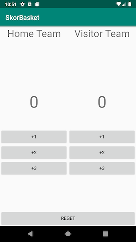

# ViewModel Lanjut

## Langkah Percobaan

- Bukalah project **SkorBasket** yang ada di repository starter code.
- Perhatikan struktur project yang telah disediakan, terdapat dua package
 `fragments` dan `viewmodels`. Pada project ini tampilan utama terdiri dari
 gabungan fragment-fragment yang disusun sehingga menjadi tampilan seperti
 berikut.

 

- Pelajari layout pada `activity_main.xml` dan fragment-fragment yang
 menyusunnya.
- Pada project ini terdapat 3 buah informasi yang dibutuhkan, skor home, skor
 visitor dan status pemenang. Sehingga pada bagian ViewModel diperlukan
 menyimpan ketiga informasi tersebut.
- Bukalah class `SharedScore`, dan atur sebagai class turunan dari
 `AndroidviewModel`

  ```java
  public class SharedScore extends AndroidViewModel {

  // ....

  }
  ```
- Sebuah class turunan dari `AndroidViewModel` wajib mengimplementasikan
 constructor yang sama. Generate constructor dengan menekan shortcut `Alt +
 Enter`(atau menekan icon lampu).
- Tambahkan tiga atribut untuk menyimpan informasi yang dibutuhkan. Letakkan
 pada baris sebelum constructor.

  ```java
  private MutableLiveData<Integer> scoreHome;
  private MutableLiveData<Integer> scoreVisitor;
  private MutableLiveData<Boolean> winner;
  ```

- Instansiasi ketiga atribut yang dibutuhkan pada constructor.

  ```java
  public SharedScore(@NonNull Application application) {
    super(application);
    scoreHome = new MutableLiveData<>();
    scoreVisitor = new MutableLiveData<>();
    winner = new MutableLiveData<>();
  }
  ```

- Tambahkan getter serta setter pada class `SharedScore`. Perhatikan pada bagian
 setter, parameter yang digunakan sesuai dengan tipe generic yang dibutuhkan.

  ```java
  public void setScoreHome(Integer score){
      scoreHome.setValue(score);
  }

  public LiveData<Integer> getScoreHome(){
      return scoreHome;
  }

  public void setScoreVisitor(Integer score){
      scoreVisitor.setValue(score);
  }

  public LiveData<Integer> getScoreVisitor(){
      return scoreVisitor;
  }

  public void setWinner(Boolean result){
      winner.setValue(result);
  }

  public LiveData<Boolean> getWinner(){
      return winner;
  }
  ```

- Pada bagian ini telah diselesaikan tahapan untuk pemodelan ViewModel. Semua
 data yang digunakan, interaksi melalui ViewModel ini.

- Bukalah file `HomeFragment.java`, terdapat atribut-atribut yang sudah
 disediakan.
- Instansiasi ViewModel `SharedScore` pada method onCreate. Perhatikan kode
 berikut. Untuk instansiasi ViewModel dapat menggunakan ViewModelProviders atau
 Factory, sehingga didapatkan instance ViewModel yang sama.

  ```java
  @Override
  public void onCreate(@Nullable Bundle savedInstanceState) {
      super.onCreate(savedInstanceState);
      sharedScore = ViewModelProviders.of(requireActivity()).get(SharedScore.class);
  }
  ```

- Perhatikan pada method `onViewCreated()`, pada bagian ini akan ditambahkan
  mekanisme penampilan skor pada tim Home dengan menggunakan Observer Pattern.

- Dengan pendekatan Observer Pattern, maka ketika terjadi perubahan UI akan
 mendapatkan notifikasi data tanpa perlu melakukan proses pengambilan data.

- Tambahkan logic berikut yang akan melakukan proses update Text ketika terjadi
 perubahan.

  ```java
  sharedScore.getScoreHome().observe(requireActivity(), new Observer<Integer>() {
      @Override
      public void onChanged(Integer score) {
          scoreHome.setText(String.valueOf(score));
          scoreDefault = score;
      }
  });
  ```
- Observer Pattern memerlukan Publisher. Pada `HomeFragment` terdapat tiga buah
 tombol, yang digunakan untuk memperbarui informasi skor. Pada langkah berikut,
 akan dilakukan pengaturan publisher dengan memanfaatkan ViewModel.

  ```java
  scoreDuaHome.setOnClickListener(new View.OnClickListener() {
      @Override
      public void onClick(View view) {
          sharedScore.setScoreHome(scoreDefault + 2);
      }
  });

  scoreTigaHome.setOnClickListener(new View.OnClickListener() {
      @Override
      public void onClick(View view) {
          sharedScore.setScoreHome(scoreDefault + 3);
      }
  });

  scoreSatuHome.setOnClickListener(new View.OnClickListener() {
      @Override
      public void onClick(View view) {
          sharedScore.setScoreHome(scoreDefault + 1);
      }
  });
  ```

- Deploy project, dan ujilah aplikasi apakah sudah bisa mengupdate informasi
 skor pada tim Home.
- Jika semua fungsi telah berjalan tanpa ada masalah. Ulangi langkah yang sama
  pada tim Visitor.
